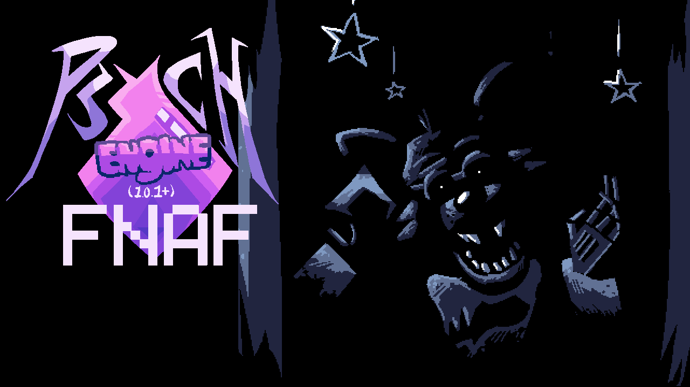
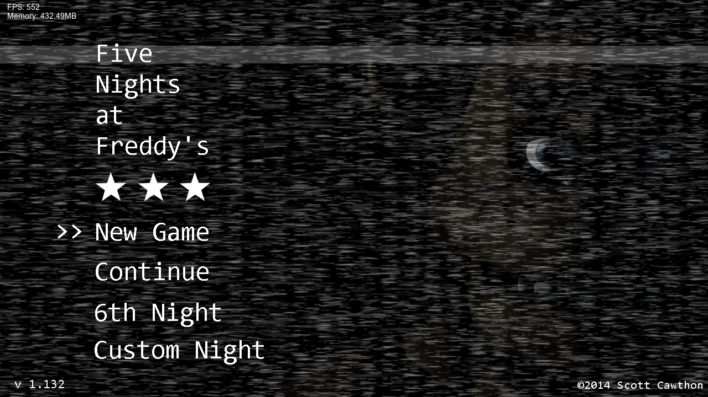
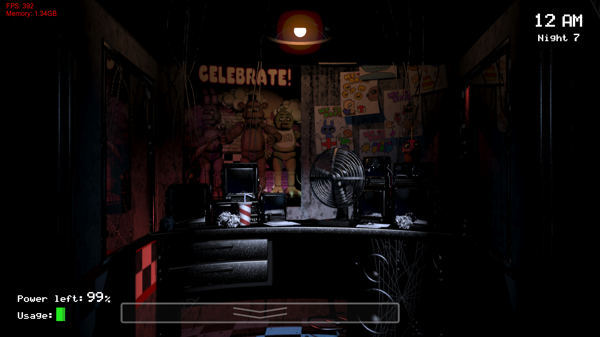
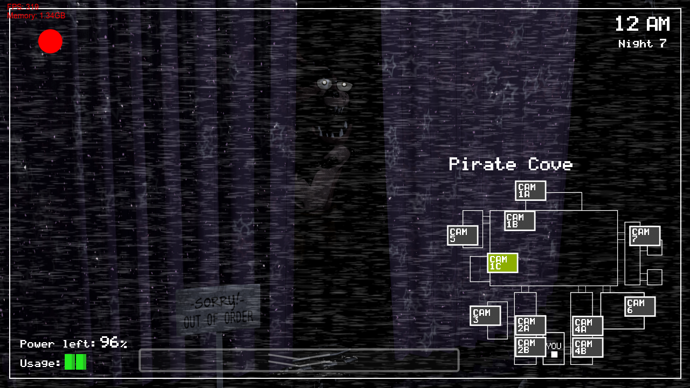

Uploaded on behalf of ThatFNaCPorter, a port of Five Nights at Freddy's to [Psych Engine](https://github.com/ShadowMario/FNF-PsychEngine)!

## Credits:
* Rudyrue -- Made the HaxeFlixel base template script
* ThatFNaCPorter -- Programmer

## About:
This version generally attempts to stay as true to the original as possible, with bugs only being fixed unintentionally by optimized coding methods.

Main fixes:

	* Game has unlocked framerate, being able to run at over 60 fps and has playBackRate support!
	* Perspective shader is smoother, leaving no crust behind!

Bugs uninentionally fixed:

	* Main menu selection fixes
	* Being able to win at lower framerates
	* Being able to kill Foxy
	* Cameras being broken when Foxy is running
	* Being able to flip up the camera again when getting jumpscared (i think??)
	* Being able to honk Freddy's nose inside the cameras
	* Hallucinations not properly being muted when Bonnie or Chica are in the hall corners before night 4
	* Certain props not being hidden/shown correctly
	* Scares being able to override each other

(list will be added on to as I remember what was changed)

And of course, none of the Clickteam Binds have been added in.

## Installation:
- download
- Place in mods/ of a folder of Psych Engine (1.0.1+)
- now have fnaf in psych

## Example Images:

